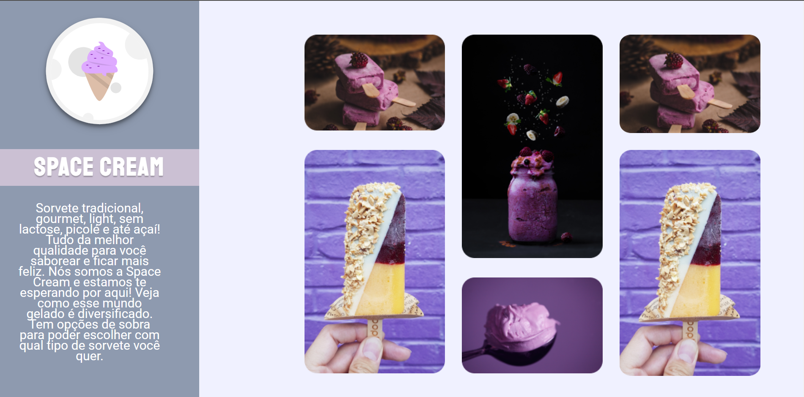

# 🧠 Recriando Layout Space Cream

> Responsividade

---

## 🛠️ Tecnologia

  

---

## 👨‍🎓 O que aprendi

- Usar TAG's semânticas
- Trabalhar com o GRID
- Usar @keyframe
- Aplicar o Mobile First
- Aplicar o Box Model
- Usar o Root para estilizar a aplicação

---

## 📧 Contato

<a href = "mailto:probertos717@gmail.com">